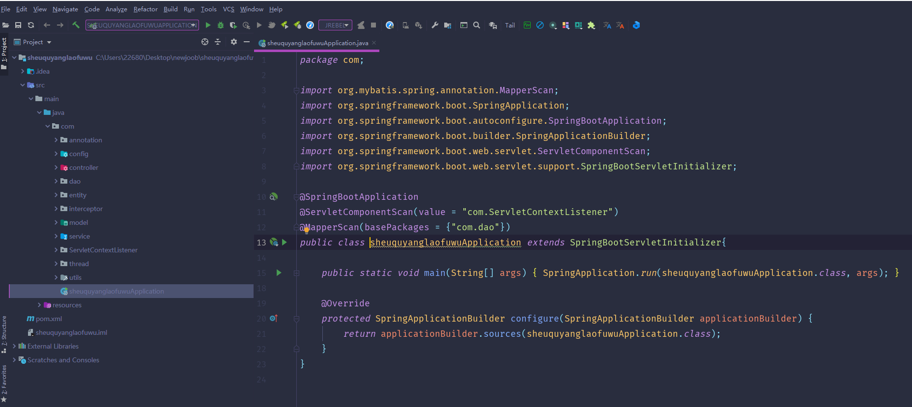
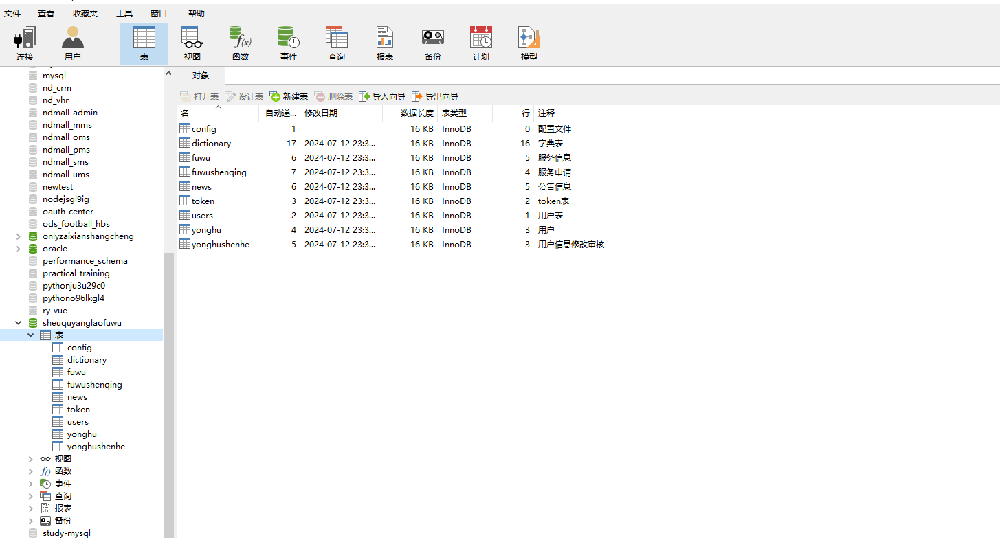
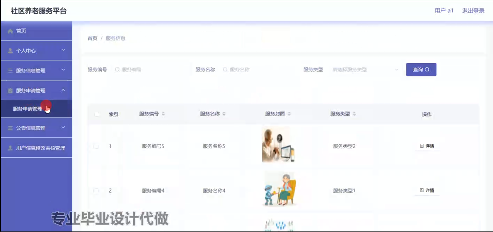
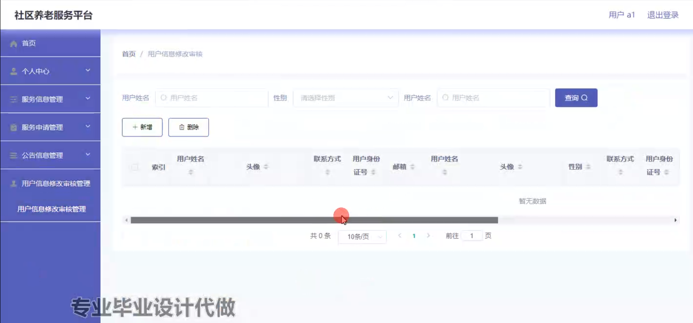
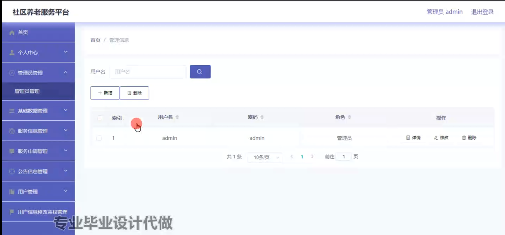
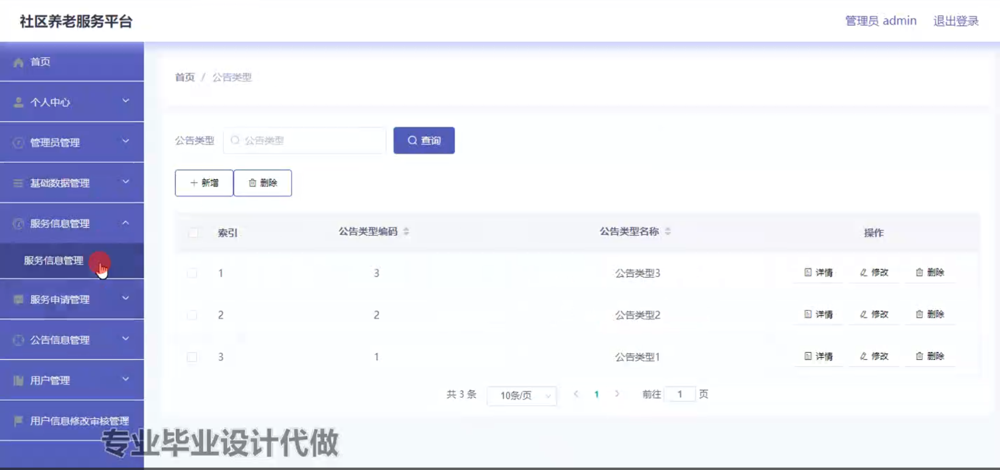
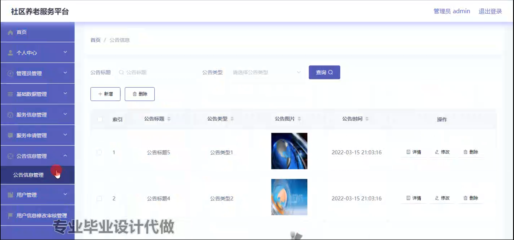
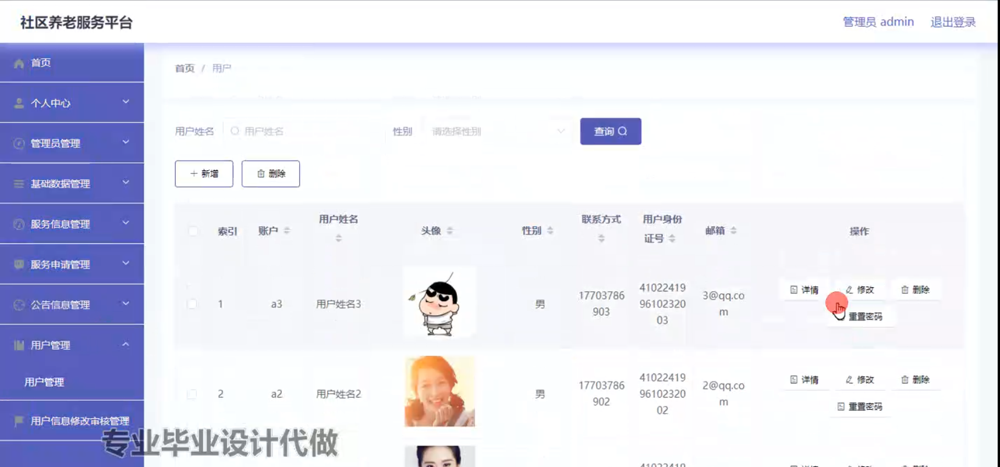

# 基于springboot的社区养老服务平台

#### 介绍

随着人口老龄化的加剧，养老问题成为社会关注的焦点。传统的养老模式难以满足日益多样化和个性化的养老需求，社区养老作为一种新兴的养老方式，逐渐受到青睐。然而，社区养老服务在实施过程中面临着信息不畅通、服务资源分配不均、管理效率低下等问题。
本基于 Spring Boot 的社区养老服务平台旨在构建一个信息化、智能化的社区养老服务体系，整合社区内的养老资源，提高服务质量和管理效率，为老年人提供更加便捷、高效、贴心的养老服务。

#### 技术栈

后端技术栈：Springboot+Mysql+Maven

前端技术栈：Vue+Html+Css+Javascript+ElementUI

开发工具：Idea+Vscode+Navicate

#### 系统功能介绍

（一）管理员角色  
个人中心：管理员可以在个人中心查看和修改自己的个人信息，如联系方式、登录密码等。  
管理员管理：对其他管理员进行添加、删除、修改权限等操作，确保管理团队的合理配置。  
基础数据管理：  
维护社区老年人的基本信息，包括姓名、年龄、性别、健康状况等。  
管理服务提供商的信息，如服务类型、收费标准、服务评价等。  
服务信息管理：  
发布和更新各类养老服务的详细信息，如医疗护理、康复保健、生活照料、文化娱乐等。  
对服务内容、服务时间、服务地点等进行安排和调整。  
服务申请管理：  
处理老年人或其家属提交的服务申请，包括审核申请资格、分配服务资源等。  
跟踪服务申请的处理进度，及时反馈给申请人。  
公告信息管理：  
发布社区养老服务的相关公告，如活动通知、政策解读、服务变更等。  
确保公告信息的准确性和及时性，方便老年人获取重要信息。  
用户管理：  
对社区老年人用户进行注册管理，审核用户信息的真实性和完整性。  
对用户的账户进行启用、禁用等操作，保障系统的安全性。  
用户信息修改审核管理：  
审核老年人用户提交的个人信息修改申请，确保信息的准确性和合法性。  

（二）用户角色  
个人中心：用户可以在个人中心查看和修改自己的个人信息，如联系方式、家庭住址等。  
服务信息管理：  
浏览社区提供的各类养老服务信息，了解服务内容和详情。  
根据自身需求选择适合的服务项目。  
服务申请管理：  
在线提交养老服务申请，填写申请表格和相关需求。  
查看服务申请的审批进度和结果。  
公告信息管理：  
及时获取社区发布的公告信息，了解社区养老服务的最新动态。  
用户信息修改审核管理：  
提交个人信息修改申请，等待管理员审核。  

#### 系统作用

提升服务质量  
为老年人提供更加精准、个性化的养老服务，满足其多样化的需求。  

优化资源配置  
合理分配社区内的养老服务资源，提高资源利用效率。  

增强社区互动  
促进老年人之间、老年人与服务提供商之间的交流与互动，营造温馨的社区养老氛围。  

提高管理效率  
实现养老服务的信息化管理，减少人工操作，降低管理成本。  

#### 系统功能截图

代码结构

数据库表

登录

用户端个人信息

服务消息管理

用户信息修改审核管理

管理员管理

基础数据管理

公告信息管理

用户管理

#### 总结

基于 Spring Boot 的社区养老服务平台为社区养老服务的发展提供了有力的支持。然而，该系统在实际运行中可能存在一些挑战和不足，例如系统的稳定性和可靠性需要持续保障，服务的质量和效果难以完全量化评估，对于一些特殊需求的老年人服务覆盖不够全面等。未来，我们将不断完善系统功能，加强与相关部门和机构的合作，进一步提升社区养老服务的水平和质量，为老年人创造更加美好的晚年生活。

#### 使用说明

创建数据库，执行数据库脚本 修改jdbc数据库连接参数 下载安装maven依赖jar 启动idea中的springboot项目

后台登录页面
http://localhost:8080/sheuquyanglaofuwu/admin/dist/index.html

管理员				账户:admin 		密码：admin

用户				账户:a1 		密码：123456